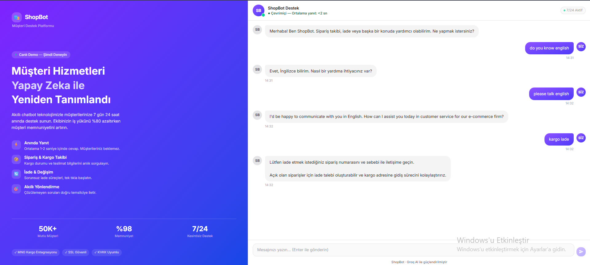

# 💬 ShopBot — AI Customer Service Chatbot

An AI-powered customer service chatbot built with Groq AI, designed for e-commerce businesses to handle orders, returns, and customer inquiries 24/7.

## 🔗 Live Demo
[chatbot-demo-seven-lovat.vercel.app](https://chatbot-demo-seven-lovat.vercel.app)

## 📷 Screenshots




## ✨ Features
- Groq AI (Llama 3.3) powered conversational responses
- Order tracking & return request handling
- Smart routing to human agents
- Real-time response (< 2 seconds)
- 7/24 availability

## 🔒 Security
- Mozilla Observatory **A+ (120/100)** — 10/10 tests passed
- Google PageSpeed **100/100**
- Nonce-based Content Security Policy (CSP)
- CORS protection
- Rate limiting

## 🛠️ Tech Stack
- Next.js 15
- TypeScript
- Tailwind CSS
- Groq AI API
- Vercel

## 🚀 Getting Started
```bash
git clone https://github.com/FatihEmreBARUTCU0/chatbot-demo
cd chatbot-demo
npm install
# .env.local dosyası oluştur
# GROQ_API_KEY=your_key_here
npm run dev
```
